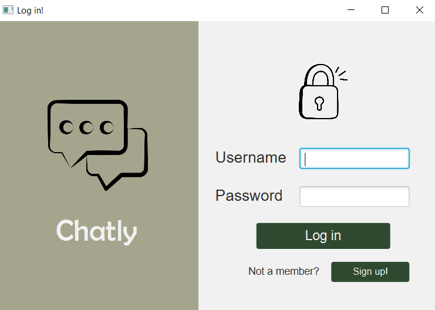
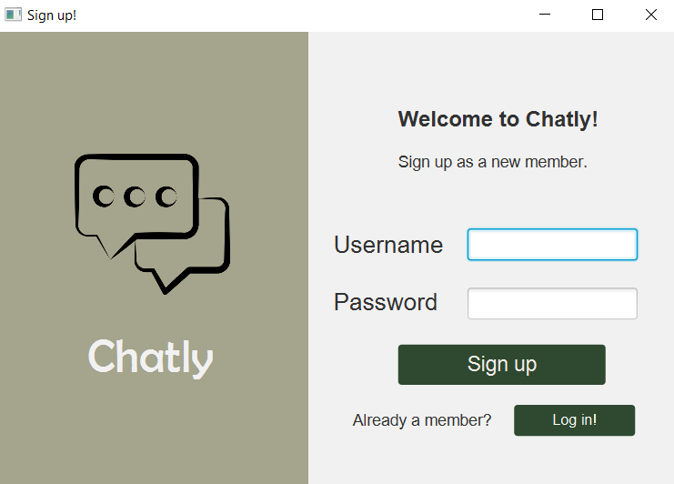
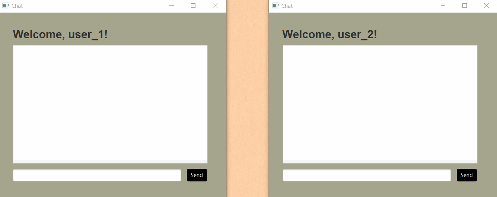

# Chatly
Java socket application for a chat, which prompts users to signup or login first. Credentials are further stored in a relational database. Created with Java and PostgreSQL. 

## Table of contents
* [General info](#general-info)
* [Technologies](#technologies)

## General info 
Chatly is a chat application allowing users to exchange instant messages after creating an account. Application starts with Login page, where users can enter their username and password. 

A signup form is available for new members. Registered credentials are stored in the database. 

Once the members are logged in, they are able to send messages. This project is an example of a basic two-way Client and Server setup, using a socket connection.

To communicate over a socket connection, streams are used to both input and output the messages.

## Technologies 
Project is created with: 
* Java version: 11.0.9
* PostgreSQL version: 42.2.5 
* JavaFX version: 13 
